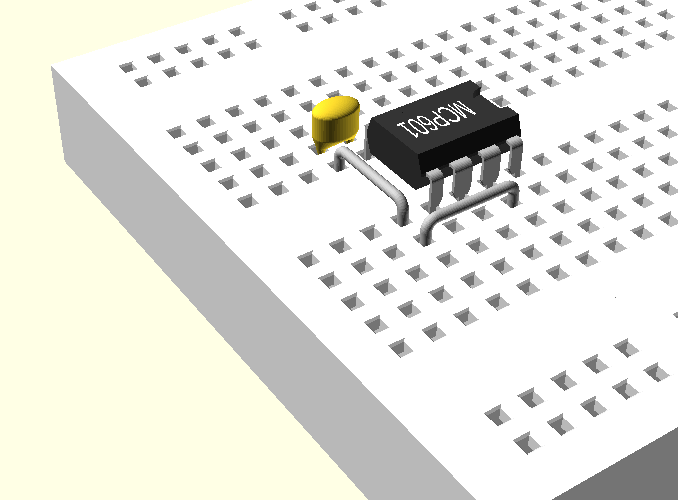

# MCP601 on Breadboard

This project started as an exploration of using 3D parts brought together from different sources. 

* A solderless breadboard derived from this project 
   Customizable Parametric OpenSCAD Breadboard [https://www.thingiverse.com/thing:3057115](https://www.thingiverse.com/thing:3057115)
* Parts derived from [https://github.com/nophead/NopSCADlib](https://github.com/nophead/NopSCADlib)
    * MCP601
	* jumpers (hook-up wire)
* Parts created within this repository. Note that SolidPython https://github.com/SolidCode/SolidPython was used to generate this 
  OpenSCAD file. 
    * 0.1 µF capacitor 

A clone of the NopSCADlib repository needs to reside in the same folder as a clone of this MCP601 repository.

~~~~
2020-10-10  03:24 PM    <DIR>          MCP601
2020-10-10  03:30 PM    <DIR>          NopSCADlib
~~~~

Image created by OpenSCAD

[link to youtube video for more angles](https://youtu.be/9dhd64a-zAU)

