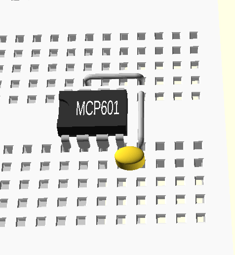

# MCP601 on Breadboard

  *{just exploring what can be done at this point}*

This project started as an exploration of using 3D parts brought together from different sources. 

* A solderless breadboard derived from this project 
   Customizable Parametric OpenSCAD Breadboard [https://www.thingiverse.com/thing:3057115](https://www.thingiverse.com/thing:3057115)
* Parts derived from [https://github.com/nophead/NopSCADlib](https://github.com/nophead/NopSCADlib)
    * A clone of that repository needs to reside in the same foler as a clone of this MCP601 repository.
* Parts created within this repository.	

~~~~
2020-10-10  03:24 PM    <DIR>          MCP601
2020-10-10  03:30 PM    <DIR>          NopSCADlib
~~~~

Image created by OpenSCAD

